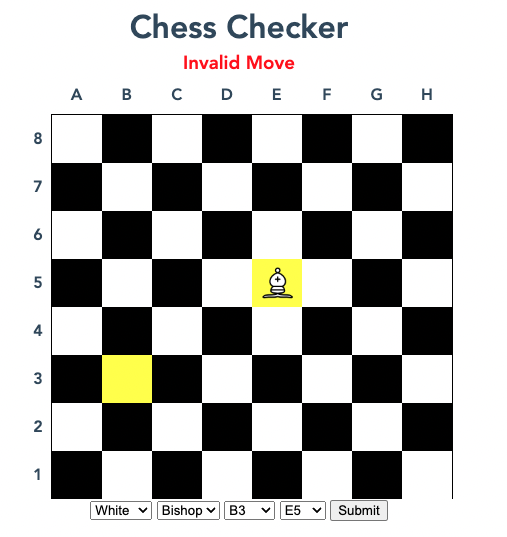

# Chess Checker

**CLUB** - Cloud Hubble

**AUTHOR** - Ed Cox

Chess Checking app to validate moves on a chess board.

## Installation

To install the relevant python packages, either use

```pip install flask```

or

```pip install -r requirements.txt```

Then, fire up the Flask app from the main directory by executing

```flask run```

or

```python app.py```

Then navigate to <http://127.0.0.1:5000> in your browser.

## How to use

In the UI, select the **Colour, Piece, Start Position and End Position** of your move. If the move is valid, the **can_move** function returns **True**, and you will see the following:


If the move is invalid, the **can_move** function returns **False**, and you will see this instead:


